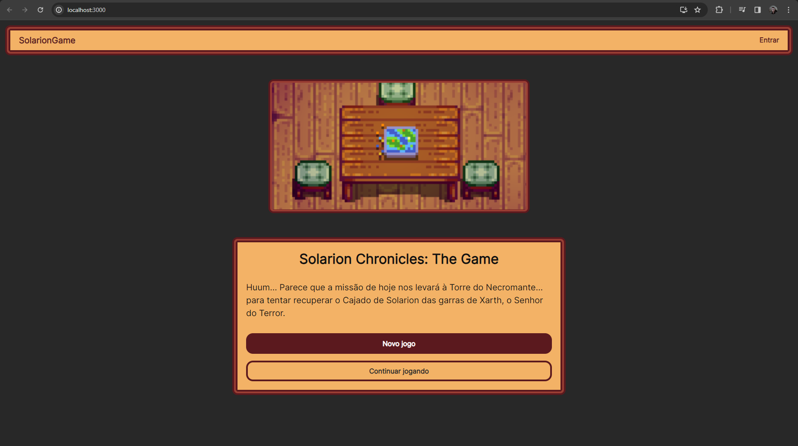

# SolarionGame

Solarion Chronicles: The Game, uma aventura de narrativa interativa (jogo de escolhas) baseado em um evento presente no jogo 'Stardew Valley'.

O intuito dessa série de repositórios é possuir um projeto atual com bibliotecas e práticas que trabalho normalmente, para usar como base em outros projetos ou até servir de início para novos, como uma forma de 'template'.

## Principais funcionalidades

* Jogar o cenário de 'Solarion Chronicles: The Game';
* Criar/Editar conta de usuário;
* Realizar login;
* Recuperar senha;
* Salvar pontuação obtida;
* Listar pontuações
* Visualizar dashboard das pontuações (admin);

## Repositórios relacionados

* [solarion-game-backend](https://github.com/RicardoPauloCunha/solarion-game-backend)
* [solarion-game-frontend-mobile](https://github.com/RicardoPauloCunha/solarion-game-frontend-mobile)

## Pré-requisitos

* Node
* Yarn
* React

# Executando o projeto

1. Clone o repositório:

```bash
git clone https://github.com/RicardoPauloCunha/solarion-game-frontend-web
```

2. Abra o arquivo ```.env.development``` para adicionar as configurações do ambiente de desenvolvimento (```.env.production``` para produção):

3. Em ```REACT_APP_API_URL```, altere o texto **API_URL_HERE** para a URL do backend que será utilizado e coloque uma **/** no final (exemplo: http://localhost:5000/) ([solarion-game-backend](https://github.com/RicardoPauloCunha/solarion-game-backend));

4. Execute o comando no terminal para instalar os pacotes:

```bash
yarn install
```

5. Em seguida, o comando para executar a aplicação:

```bash
yarn start
```

6. Abra [http://localhost:3000](http://localhost:3000) para acessar o site.

<div align="center">



</div>

7. Por fim, inicie um 'Novo jogo' e finalize o cenário para obter uma pontuação e ???.

> As imagens e a história presente no cenário de 'Solarion Chronicles: The Game' foram retiradas de um evento no jogo 'Stardew Valley', não sendo de minha autoria, apesar que algumas partes foram editadas para melhorar o contexto fora do jogo mencionado.